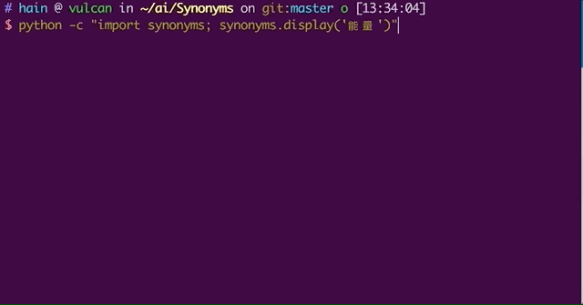
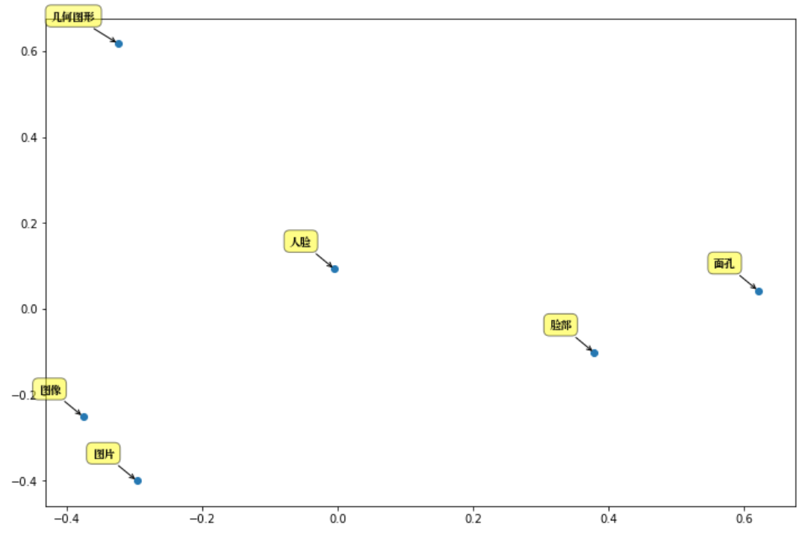
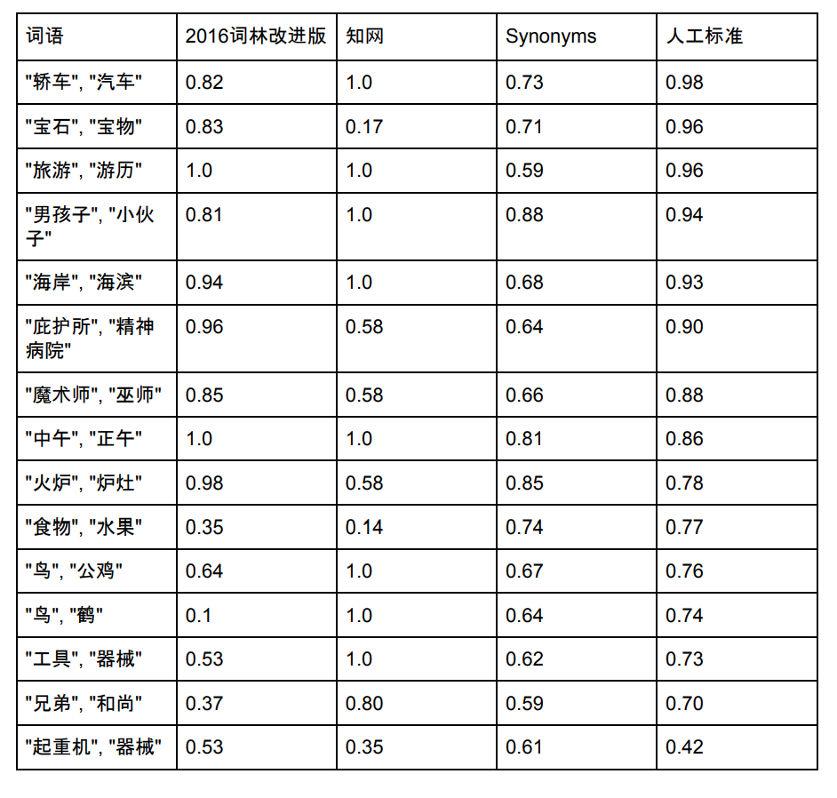

[](https://pypi.python.org/pypi/synonyms) [](https://pypi.org/pypi/synonyms/) [](https://pypi.org/pypi/synonyms/) [](https://pypi.org/pypi/synonyms/)
[](https://pypi.org/pypi/synonyms/)

# Project Sponsor

[Chatopera 云服务](https://docs.chatopera.com)，低代码上线智能对话机器人服务！

[![chatoper banner][co-banner-image]][co-url]

[co-banner-image]: https://user-images.githubusercontent.com/3538629/42383104-da925942-8168-11e8-8195-868d5fcec170.png
[co-url]: https://docs.chatopera.com

# Synonyms

Chinese Synonyms for Natural Language Processing and Understanding.

更好的中文近义词：聊天机器人、智能问答工具包。

`synonyms`可以用于自然语言理解的很多任务：文本对齐，推荐算法，相似度计算，语义偏移，关键字提取，概念提取，自动摘要，搜索引擎等。

# Table of Content:

- [Install](https://github.com/chatopera/Synonyms#welcome)
- [Usage](https://github.com/chatopera/Synonyms#usage)
- [Quick Get Start](https://github.com/chatopera/Synonyms#quick-get-start)
- [Valuation](https://github.com/chatopera/Synonyms#valuation)
- [Benchmark](https://github.com/chatopera/Synonyms#benchmark)
- [Statement](https://github.com/chatopera/Synonyms#statement)
- [References](https://github.com/chatopera/Synonyms#references)
- [Frequently Asked Questions](https://github.com/chatopera/Synonyms#frequently-asked-questions-faq)
- [License](https://github.com/chatopera/Synonyms#license)

# Welcome

```bash
pip install -U synonyms
python -c "import synonyms" # download word vectors file
```

兼容 py2 和 py3，当前稳定版本 [v3.x](https://github.com/chatopera/Synonyms/releases)。

**提示：安装后初次使用会下载词向量文件，下载速度取决于网络情况。**

[#118 词向量文件一直下载不下来？](https://github.com/chatopera/Synonyms/issues/118)可尝试按下述方法设置国内的词向量备份地址：

```bash
export SYNONYMS_WORD2VEC_BIN_URL_ZH_CN=https://gitee.com/chatopera/cskefu/attach_files/610602/download/words.vector.gz
pip install -U synonyms
python -c "import synonyms" # download word vectors file
```

其它环境变量介绍见下文，[Windows cmd 使用 `set SYNONYMS_WORD2VEC_BIN_URL_ZH_CN` 设置环境变量](https://blog.csdn.net/songchunyi/article/details/6413759)。

本文档的配置和接口说明面向 python 工具包。



## Usage

支持使用环境变量配置分词词表和 word2vec 词向量文件。

| 环境变量                            | 描述                                                                                                                                                                                               |
| ----------------------------------- | -------------------------------------------------------------------------------------------------------------------------------------------------------------------------------------------------- |
| _SYNONYMS_WORD2VEC_BIN_MODEL_ZH_CN_ | 使用 word2vec 训练的词向量文件，二进制格式。                                                                                                                                                       |
| _SYNONYMS_WORDSEG_DICT_             | 中文分词[**主字典**](https://github.com/fxsjy/jieba#%E5%BB%B6%E8%BF%9F%E5%8A%A0%E8%BD%BD%E6%9C%BA%E5%88%B6)，格式和使用[参考](https://github.com/fxsjy/jieba#%E8%BD%BD%E5%85%A5%E8%AF%8D%E5%85%B8) |

### synonyms#nearby(word [, size = 10])

```python
import synonyms
print("人脸: ", synonyms.nearby("人脸"))
print("识别: ", synonyms.nearby("识别"))
print("NOT_EXIST: ", synonyms.nearby("NOT_EXIST"))
```

`synonyms.nearby(WORD [,SIZE])`返回一个元组，元组中包含两项：`([nearby_words], [nearby_words_score])`，`nearby_words`是 WORD 的近义词们，也以 list 的方式存储，并且按照距离的长度由近及远排列，`nearby_words_score`是`nearby_words`中**对应位置**的词的距离的分数，分数在(0-1)区间内，越接近于 1，代表越相近；`SIZE` 是返回词汇数量，默认 10。比如:

```python
synonyms.nearby(人脸, 10) = (
    ["图片", "图像", "通过观察", "数字图像", "几何图形", "脸部", "图象", "放大镜", "面孔", "Mii"],
    [0.597284, 0.580373, 0.568486, 0.535674, 0.531835, 0.530
095, 0.525344, 0.524009, 0.523101, 0.516046])
```

在 OOV 的情况下，返回 `([], [])`，目前的字典大小: 435,729。

### synonyms#compare(sen1, sen2 [, seg=True])

两个句子的相似度比较

```python
    sen1 = "发生历史性变革"
    sen2 = "发生历史性变革"
    r = synonyms.compare(sen1, sen2, seg=True)
```

其中，参数 seg 表示 synonyms.compare 是否对 sen1 和 sen2 进行分词，默认为 True。返回值：[0-1]，并且越接近于 1 代表两个句子越相似。

```python
旗帜引领方向 vs 道路决定命运: 0.429
旗帜引领方向 vs 旗帜指引道路: 0.93
发生历史性变革 vs 发生历史性变革: 1.0
```

### synonyms#display(word [, size = 10])

以友好的方式打印近义词，方便调试，`display(WORD [, SIZE])`调用了 `synonyms#nearby` 方法。

```python
>>> synonyms.display("飞机")
'飞机'近义词：
  1. 飞机:1.0
  2. 直升机:0.8423391
  3. 客机:0.8393003
  4. 滑翔机:0.7872388
  5. 军用飞机:0.7832081
  6. 水上飞机:0.77857226
  7. 运输机:0.7724742
  8. 航机:0.7664748
  9. 航空器:0.76592904
  10. 民航机:0.74209654
```

`SIZE` 是打印词汇表的数量，默认 10。

### synonyms#v(word)

获得一个词语的向量，该向量为 numpy 的 array，当该词语是未登录词时，抛出 KeyError 异常。

```python
>>> synonyms.v("飞机")
array([-2.412167  ,  2.2628384 , -7.0214124 ,  3.9381874 ,  0.8219283 ,
       -3.2809453 ,  3.8747153 , -5.217062  , -2.2786229 , -1.2572327 ],
      dtype=float32)
```

### synonyms#sv(sentence, ignore=False)

获得一个分词后句子的向量，向量以 BoW 方式组成

```python
    sentence: 句子是分词后通过空格联合起来
    ignore: 是否忽略OOV，False时，随机生成一个向量
```

### synonyms#seg(sentence)

中文分词

```python
synonyms.seg("中文近义词工具包")
```

分词结果，由两个 list 组成的元组，分别是单词和对应的词性。

```python
(['中文', '近义词', '工具包'], ['nz', 'n', 'n'])
```

**该分词不去停用词和标点。**

### synonyms#keywords(sentence [, topK=5, withWeight=False])

提取关键词，默认按照重要程度提取关键词。

```
keywords = synonyms.keywords("9月15日以来，台积电、高通、三星等华为的重要合作伙伴，只要没有美国的相关许可证，都无法供应芯片给华为，而中芯国际等国产芯片企业，也因采用美国技术，而无法供货给华为。目前华为部分型号的手机产品出现货少的现象，若该形势持续下去，华为手机业务将遭受重创。")
```

## Contribution

Get more logs for debugging, set environment variable.

```
SYNONYMS_DEBUG=TRUE
```

## PCA

以“人脸”为例主要成分分析：



## Quick Get Start

```bash
$ pip install -r Requirements.txt
$ python demo.py
```

## Change logs

更新情况[说明](./CHANGELOG.md)。

## Voice of Users

用户怎么说：


## Data

data is built based on [wikidata-corpus](https://github.com/Samurais/wikidata-corpus).

## Valuation

### 同义词词林

《同义词词林》是梅家驹等人于 1983 年编纂而成，现在使用广泛的是哈工大社会计算与信息检索研究中心维护的《同义词词林扩展版》，它精细的将中文词汇划分成大类和小类，梳理了词汇间的关系，同义词词林扩展版包含词语 7 万余条，其中 3 万余条被以开放数据形式共享。

### 知网, HowNet

HowNet，也被称为知网，它并不只是一个语义字典，而是一个知识系统，词汇之间的关系是其一个基本使用场景。知网包含词语 8 余条。

国际上对词语相似度算法的评价标准普遍采用 Miller&Charles 发布的英语词对集的人工判定值。该词对集由十对高度相关、十对中度相关、十对低度相关共 30 个英语词对组成,然后让 38 个受试者对这 30 对进行语义相关度判断，最后取他们的平均值作为人工判定标准。然后不同近义词工具也对这些词汇进行相似度评分，与人工判定标准做比较，比如使用皮尔森相关系数。在中文领域，使用这个词表的翻译版进行中文近义词比较也是常用的办法。

### 对比

Synonyms 的词表容量是 435,729，下面选择一些在同义词词林、知网和 Synonyms 都存在的几个词，给出其近似度的对比：



注：同义词林及知网数据、分数[来源](https://github.com/yaleimeng/Final_word_Similarity)。Synonyms 也在不断优化中，新的分数可能和上图不一致。

更多[比对结果](./VALUATION.md)。

## Used by

[Github 关联用户列表](https://github.com/chatopera/Synonyms/network/dependents?package_id=UGFja2FnZS01MjY2NDc1Nw%3D%3D)


## Benchmark

Test with py3, MacBook Pro.

```
python benchmark.py
```

++++++++++ OS Name and version ++++++++++

Platform: Darwin

Kernel: 16.7.0

Architecture: ('64bit', '')

++++++++++ CPU Cores ++++++++++

Cores: 4

CPU Load: 60

++++++++++ System Memory ++++++++++

meminfo 8GB

`synonyms#nearby: 100000 loops, best of 3 epochs: 0.209 usec per loop`

## Live Sharing

[52nlp.cn](http://www.52nlp.cn/synonyms-%E4%B8%AD%E6%96%87%E8%BF%91%E4%B9%89%E8%AF%8D%E5%B7%A5%E5%85%B7%E5%8C%85)

[机器之心](https://www.jiqizhixin.com/articles/2018-01-14-3)

[线上分享实录: Synonyms 中文近义词工具包 @ 2018-02-07](http://gitbook.cn/gitchat/activity/5a563545a8b23d387720ccd5)

## Statement

[Synonyms](https://github.com/chatopera/Synonyms)发布证书 MIT。数据和程序可用于研究和商业产品，必须注明引用和地址，比如发布的任何媒体、期刊、杂志或博客等内容。

```
@online{Synonyms:hain2017,
  author = {Hai Liang Wang, Hu Ying Xi},
  title = {中文近义词工具包Synonyms},
  year = 2017,
  url = {https://github.com/chatopera/Synonyms},
  urldate = {2017-09-27}
}
```

# References

[wikidata-corpus](https://github.com/Samurais/wikidata-corpus)

[word2vec 原理推导与代码分析](http://www.hankcs.com/nlp/word2vec.html)

# Frequently Asked Questions (FAQ)

1. 是否支持添加单词到词表中？

不支持，欲了解更多请看 [#5](https://github.com/chatopera/Synonyms/issues/5)

2. 词向量的训练是用哪个工具？

Google 发布的[word2vec](https://code.google.com/archive/p/word2vec/)，该库由 C 语言编写，内存使用效率高，训练速度快。gensim 可以加载 word2vec 输出的模型文件。

3. 相似度计算的方法是什么？

[详见 #64](https://github.com/chatopera/Synonyms/issues/64)

# Authors

[Hai Liang Wang](https://pre-angel.com/peoples/hailiang-wang/)

[Hu Ying Xi](https://github.com/huyingxi)

## 自然语言处理推荐入门&工具书

本书由 [Synonyms](https://github.com/chatopera/Synonyms) 作者参与著作。

<p align="center">
  <b>快速购书<a href="https://item.jd.com/12479014.html" target="_blank">链接</a></b><br>
  <a href="https://item.jd.com/12479014.html" target="_blank">
        
  </a>
</p>

[《智能问答与深度学习》](https://item.jd.com/12479014.html) 这本书是服务于准备入门机器学习和自然语言处理的学生和软件工程师的，在理论上介绍了很多原理、算法，同时也提供很多示例程序增加实践性，这些程序被汇总到示例程序代码库，这些程序主要是帮助大家理解原理和算法的，欢迎大家下载和执行。代码库的地址是：

[https://github.com/l11x0m7/book-of-qna-code](https://github.com/l11x0m7/book-of-qna-code)

# Give credits to

[Word2vec by Google](https://code.google.com/archive/p/word2vec/)

[Wikimedia: 训练语料来源](https://dumps.wikimedia.org/)

[gensim: word2vec.py](https://github.com/RaRe-Technologies/gensim)

[SentenceSim: 相似度评测语料](https://github.com/fssqawj/SentenceSim/)

[jieba: 中文分词](https://github.com/fxsjy/jieba)

# License

[MIT](./LICENSE)

Copyright (2018-2020) Chatopera Inc. <https://www.chatopera.com>

Permission is hereby granted, free of charge, to any person obtaining a copy of this software and associated documentation files (the "Software"), to deal in the Software without restriction, including without limitation the rights to use, copy, modify, merge, publish, distribute, sublicense, and/or sell copies of the Software, and to permit persons to whom the Software is furnished to do so, subject to the following conditions:

The above copyright notice and this permission notice shall be included in all copies or substantial portions of the Software.

THE SOFTWARE IS PROVIDED "AS IS", WITHOUT WARRANTY OF ANY KIND, EXPRESS OR IMPLIED, INCLUDING BUT NOT LIMITED TO THE WARRANTIES OF MERCHANTABILITY, FITNESS FOR A PARTICULAR PURPOSE AND NONINFRINGEMENT. IN NO EVENT SHALL THE AUTHORS OR COPYRIGHT HOLDERS BE LIABLE FOR ANY CLAIM, DAMAGES OR OTHER LIABILITY, WHETHER IN AN ACTION OF CONTRACT, TORT OR OTHERWISE, ARISING FROM, OUT OF OR IN CONNECTION WITH THE SOFTWARE OR THE USE OR OTHER DEALINGS IN THE SOFTWARE.OF

## Chatopera 云服务

[https://bot.chatopera.com/](https://bot.chatopera.com/)

[Chatopera 云服务](https://bot.chatopera.com)是一站式实现聊天机器人的云服务，按接口调用次数计费。Chatopera 云服务是 [Chatopera 机器人平台](https://docs.chatopera.com/products/chatbot-platform/index.html)的软件即服务实例。在云计算基础上，Chatopera 云服务属于**聊天机器人即服务**的云服务。

Chatopera 机器人平台包括知识库、多轮对话、意图识别和语音识别等组件，标准化聊天机器人开发，支持企业 OA 智能问答、HR 智能问答、智能客服和网络营销等场景。企业 IT 部门、业务部门借助 Chatopera 云服务快速让聊天机器人上线！

<details>
<summary>展开查看 Chatopera 云服务的产品截图</summary>
<p>

<p align="center">
  <b>自定义词典</b><br>
  
</p>

<p align="center">
  <b>自定义词条</b><br>
  
</p>

<p align="center">
  <b>创建意图</b><br>
  
</p>

<p align="center">
  <b>添加说法和槽位</b><br>
  
</p>

<p align="center">
  <b>训练模型</b><br>
  
</p>

<p align="center">
  <b>测试对话</b><br>
  
</p>

<p align="center">
  <b>机器人画像</b><br>
  
</p>

<p align="center">
  <b>系统集成</b><br>
  
</p>

<p align="center">
  <b>聊天历史</b><br>
  
</p>

</p>
</details>

<p align="center">
  <b>立即使用</b><br>
  <a href="https://bot.chatopera.com" target="_blank">
      
  </a>
</p>
