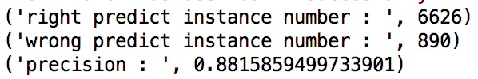
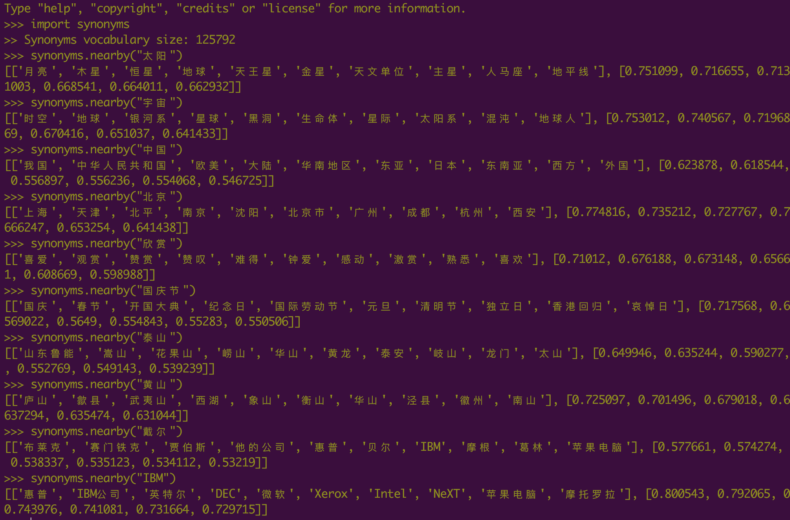

# Synonyms
Chinese Synonyms for Natural Language Processing and Understanding.
最好的中文近义词工具包。

```synonyms```可以用于自然语言理解的很多任务：文本对齐，推荐算法，相似度计算，语义偏移等。


# Welcome

```
pip install -U synonyms
```
兼容py2和py3，当前稳定版本 v1.8。


## Usage

### synonyms#nearby
```
import synonyms
print("人脸: %s" % (synonyms.nearby("人脸")))
print("识别: %s" % (synonyms.nearby("识别")))
print("NOT_EXIST: %s" % (synonyms.nearby("NOT_EXIST")))
```

```synonyms.nearby(WORD)```返回一个list，list中包含两项：```[[nearby_words], [nearby_words_score]]```，```nearby_words```是WORD的近义词们，也以list的方式存储，并且按照距离的长度由近及远排列，```nearby_words_score```是```nearby_words```中**对应位置**的词的距离的分数，分数在(0-1)区间内，越接近于1，代表越相近。比如:

```
synonyms.nearby(人脸) = [
    ["图片", "图像", "通过观察", "数字图像", "几何图形", "脸部", "图象", "放大镜", "面孔", "Mii"], 
    [0.597284, 0.580373, 0.568486, 0.535674, 0.531835, 0.530
095, 0.525344, 0.524009, 0.523101, 0.516046]]
```

在OOV的情况下，返回  ```[[], []]```，目前的字典大小: 125,792。

### synonyms#compare
两个句子的相似度比较
```
sen1 = "旗帜引领方向"
sen2 = "道路决定命运"

旗帜引领方向 vs 道路决定命运: 0.316

sen1 = "发生历史性变革"
sen2 = "取得历史性成就"

发生历史性变革 vs 取得历史性成就: 0.712
```

返回值：[0-1]，并且越接近于1代表两个句子越相似。

句子相似度性能：

在[7516条标准语料](https://github.com/fssqawj/SentenceSim/blob/master/dev.txt)上进行测试，

设定阈值为0.5：

当相似度 > 0.5 ； 返回相似；

当相似度 < 0.5 ； 返回不相似；

效果如下



### synonyms#display
以友好的方式打印近义词，方便调试，```display```调用了 ```synonyms#nearby``` 方法。

```
>>> synonyms.display("飞机")
'飞机'近义词：
  1. 架飞机:0.837399
  2. 客机:0.764609
  3. 直升机:0.762116
  4. 民航机:0.750519
  5. 航机:0.750116
  6. 起飞:0.735736
  7. 战机:0.734975
  8. 飞行中:0.732649
  9. 航空器:0.723945
  10. 运输机:0.720578
>>> synonyms.display("航母")
'航母'近义词：
  1. 航空母舰:0.916647
  2. 航舰:0.860443
  3. 舰艇:0.762755
  4. 舰载机:0.758707
  5. 舰:0.751264
  6. 驱逐舰:0.74454
  7. 战舰:0.742578
  8. 巡洋舰:0.73104
  9. 舰队:0.72761
  10. 潜艇:0.726795
```

## PCA (主成分析)


## More samples



## Demo
```
$ pip install -r Requirements.txt
$ python demo.py
```

## Data
```
synonyms/data/words.nearby.x.pklz # compressed pickle object
```

data is built based on [wikidata-corpus](https://github.com/Samurais/wikidata-corpus).

## Benchmark

Test with py3, MacBook Pro.

```
python benchmark.py
```

++++++++++ OS Name and version ++++++++++

Platform: Darwin

Kernel: 16.7.0

Architecture: ('64bit', '')

++++++++++ CPU Cores ++++++++++

Cores: 4

CPU Load: 60

++++++++++ System Memory ++++++++++

meminfo 8GB

```synonyms#nearby: 100000 loops, best of 3 epochs: 0.209 usec per loop```

## 声明
[Synonyms](https://github.com/shuzi/insuranceQA)发布证书 GPL 3.0。数据和程序可用于研究和商业产品，必须注明引用和地址，比如发布的任何媒体、期刊、杂志或博客等内容。
```
@online{Synonyms:hain2017,
  author = {Hai Liang Wang, Hu Ying Xi},
  title = {中文近义词工具包Synonyms},
  year = 2017,
  url = {https://github.com/huyingxi/Synonyms},
  urldate = {2017-09-27}
}
```

任何基于[Synonyms](https://github.com/huyingxi/Synonyms)衍生的数据和项目也需要开放并需要声明一致的“声明”。

# References

[wikidata-corpus](https://github.com/Samurais/wikidata-corpus)

[word2vec原理推导与代码分析](http://www.hankcs.com/nlp/word2vec.html)

# License
[GPL3.0](./LICENSE)
